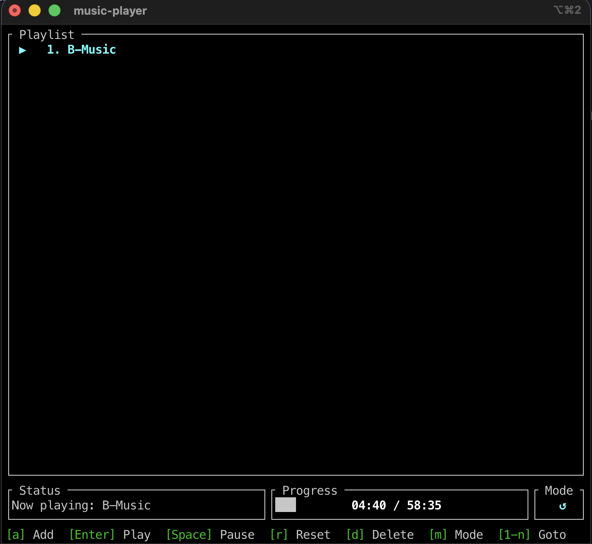
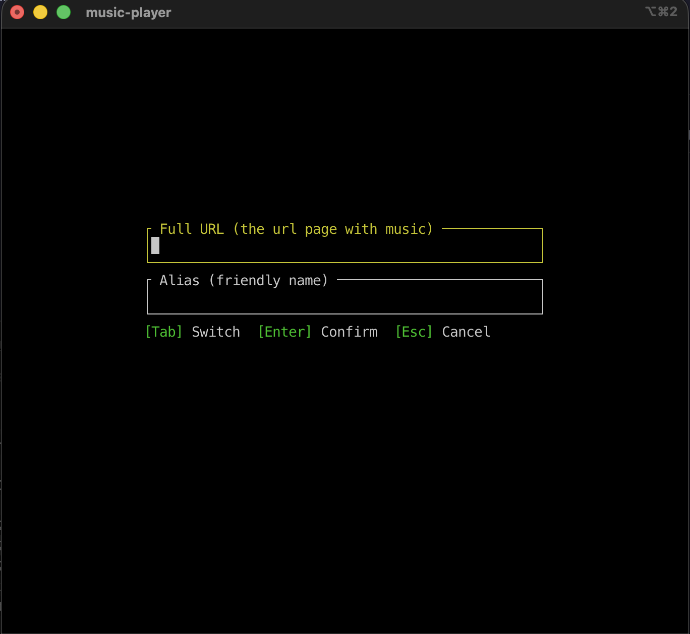
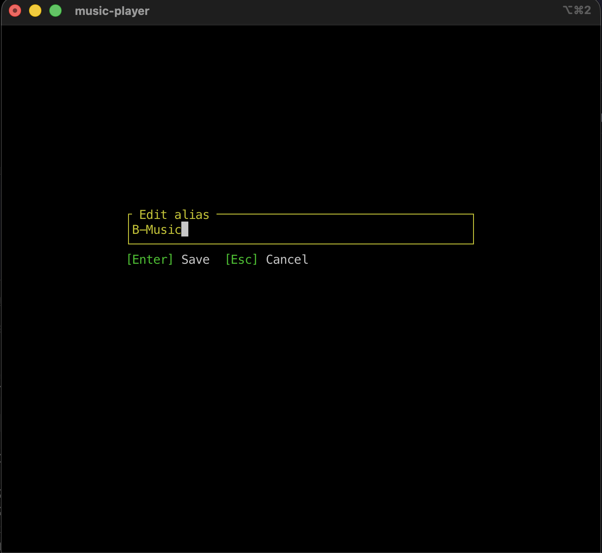
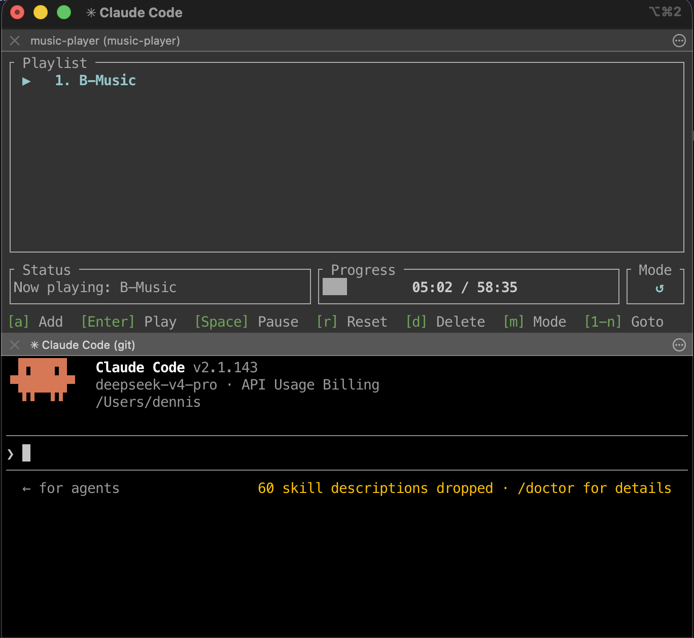
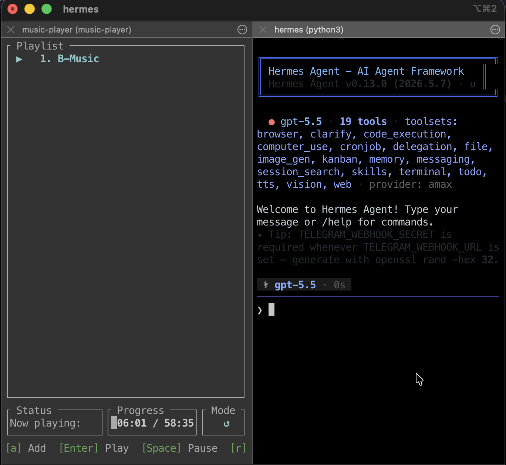

# ♪ Music Player TUI

<p align="center">
  <a href="README.md">English</a> · <strong>中文</strong>
</p>

[](https://www.rust-lang.org)
[](https://crates.io/crates/terminal-music-player)
[](https://github.com/dennislan/terminal-music-player/releases/latest)
[](LICENSE)

**一个用 Rust 构建的终端音乐播放器** — 使用 [ratatui](https://github.com/ratatui-org/ratatui) 实现 TUI 界面，[rodio](https://github.com/RustAudio/rodio) 进行音频播放。支持从 YouTube、Bilibili、SoundCloud 等数百个网站流式播放音频，全程在内存中完成，无需本地文件，无需磁盘写入。

---

## 功能特性

- **内存流式播放** — 音频被管道传输到共享缓冲区并逐步解码，下载完成前即可开始播放。
- **多站点支持** — 支持 yt-dlp 所支持的所有网站（YouTube、Bilibili、SoundCloud、NicoNico 等）。
- **播放列表管理** — 添加、删除、重命名、重新排序歌曲，以 JSON 格式持久化存储于系统标准配置目录。
- **快速跳转** — 按数字键（1–9）输入歌曲序号，按 Enter 播放。快速连续输入时仅播放最后请求的歌曲。
- **播放模式** — 顺序播放 ↺、单曲循环 ↺₁、随机播放 ⇄，按 `m` 键切换。
- **断点续播** — 自动从上次停止位置继续播放，按 `r` 键从头开始。
- **快进快退** — `←` / `→` 跳转 ±10 秒。
- **实时进度** — 显示当前时间 / 总时长及进度条。
- **错误提示** — 无效链接或下载失败时显示清晰的错误覆盖层。
- **跨平台** — 支持 Linux、macOS、Windows。

---

## 前置依赖

| 工具 | 版本 | 用途 |
|---|---|---|
| [Rust](https://www.rust-lang.org) | ≥ 1.85（edition 2024） | 构建与运行 |
| [yt-dlp](https://github.com/yt-dlp/yt-dlp) | 最新版 | 音频下载后端 |

### 安装 yt-dlp

```bash
# macOS
brew install yt-dlp

# Linux (Debian/Ubuntu)
sudo apt install yt-dlp

# Windows (scoop)
scoop install yt-dlp
```

---

## 安装

### 通过 crates.io 安装

```bash
cargo install terminal-music-player
```

### 通过 GitHub Releases 下载 (macOS, Linux, Windows)

从 [latest release](https://github.com/dennislan/terminal-music-player/releases/latest) 下载预编译的二进制文件：

| 平台 | 下载文件 |
|---|---|
| macOS (Intel) | `terminal-music-player-x86_64-apple-darwin.tar.gz`[TBD] |
| macOS (Apple Silicon) | `terminal-music-player-aarch64-apple-darwin.tar.gz` |
| Linux | `terminal-music-player-x86_64-unknown-linux-gnu.tar.gz` [TBD]|
| Windows | `terminal-music-player-x86_64-pc-windows-msvc.zip` [TBD]|

```bash
# macOS 示例 — 下载并运行
curl -LO https://github.com/dennislan/terminal-music-player/releases/latest/download/terminal-music-player-aarch64-apple-darwin.tar.gz
tar xzf terminal-music-player-aarch64-apple-darwin.tar.gz
./terminal-music-player
```

### 从源码构建

```bash
# 克隆仓库
git clone https://github.com/dennislan/terminal-music-player.git
cd terminal-music-player

# 以 release 模式构建
cargo build --release

# 二进制文件位于 target/release/terminal-music-player
```

---

## 使用方式

```bash
# 运行 TUI
cargo run

# 或直接使用编译好的二进制文件
./target/release/terminal-music-player
```

应用将在 alternate screen 中打开，按 `q` 退出。

### 快捷键

#### 播放列表导航与播放

| 按键 | 功能 |
|---|---|
| `↑` / `↓` 或 `k` / `j` | 在播放列表中导航 |
| `Enter` | 播放选中的歌曲 |
| `0`–`9` 然后 `Enter` | 按序号跳转到歌曲（从 1 开始） |
| `Space` | 暂停 / 继续 |
| `←` / `→` | 快退 10 秒 / 快进 10 秒 |
| `r` | 重置当前歌曲到 00:00 |
| `m` | 切换播放模式（顺序 → 单曲循环 → 随机） |

#### 播放列表管理

| 按键 | 功能 |
|---|---|
| `a` | 添加 URL（支持 Bilibili、YouTube 等） |
| `e` | 编辑选中歌曲的别名 |
| `d` | 删除选中歌曲（带确认提示） |
| `Alt+↑` / `Alt+↓` | 上下移动歌曲位置 |

#### 其他

| 按键 | 功能 |
|---|---|
| `q` | 退出（保存播放位置和播放列表） |
| `Esc` | 取消数字输入 / 关闭对话框 |

---

## 架构

```
src/
├── main.rs        入口点，终端设置，事件循环，按键分发
├── lib.rs         库 crate 根（暴露模块供集成测试使用）
├── app.rs         应用状态（App），屏幕管理，输入处理
├── ui.rs          ratatui 渲染 — Playlist、AddSong、EditAlias、ConfirmDelete、Error 五个屏幕
├── stream.rs      下载子进程，流式缓冲区（Arc<Mutex<Vec<u8>>> + Condvar）
├── player.rs      后台线程，mpsc 通道，rodio 播放
└── playlist.rs    Song 和 Playlist 结构体，JSON 持久化
```

### 播放器线程架构

**播放器**运行在独立的后台线程中，UI 通过 mpsc 通道与其通信：

```
┌──────────┐  命令 (mpsc)        ┌────────────┐
│   TUI    │ ────────────────▶  │  播放器     │
│  事件循环 │ ◀────────────────   │ (后台线程)  │
│          │   事件 (mpsc)       │            │
└──────────┘                     └─────┬──────┘
                                      │
                               ┌──────▼──────┐
                               │   rodio     │
                               │  (音频输出)   │
                               └─────────────┘
```

**命令**（UI → 播放器）：`Play(Song)`、`Stop`、`PauseResume`、`SeekTo(f64)`
**事件**（播放器 → UI）：`Buffering`、`Started`、`Position`、`Paused`、`Resumed`、`Finished`、`Stopped`、`Error`

### 音频流式播放流程

```
yt-dlp stdout ──▶ StreamHandle (Arc<Mutex<Vec<u8>>> + Condvar) ──▶ rodio::Decoder ──▶ DeviceSink
```

yt-dlp 以 AAC/m4a 格式下载音频并写入 stdout。`StreamHandle` 将字节累积到共享的 `Vec<u8>` 中，`Condvar` 在有新数据到达时通知解码器。rodio 逐步读取数据——播放远在下载完成之前即可开始。

### 待播放取消机制

当用户快速输入多个歌曲序号后按 Enter，仅播放**最后**请求的歌曲。之前的请求通过覆写 `pending_play_index` 取消，不会触发实际的播放切换。

---

## 播放列表存储

播放列表以 JSON 格式保存在系统配置目录中：

| 平台 | 路径 |
|---|---|
| macOS | `~/Library/Application Support/terminal-music-player/playlist.json` |
| Linux | `~/.config/terminal-music-player/playlist.json` |
| Windows | `%APPDATA%\terminal-music-player\playlist.json` |

每首歌曲存储以下字段：`url`（链接）、`alias`（别名）、`last_position`（上次播放位置，用于断点续播）。

---

## 开发

### 构建与运行

```bash
cargo build          # debug 构建
cargo check          # 仅类型检查（最快反馈）
cargo run            # 运行 TUI（在 alternate screen 中打开）
```

### 测试

```bash
cargo test           # 运行所有测试
cargo test -- <名称>  # 按名称运行单个测试
```

### 代码检查与格式化

```bash
cargo clippy         # 代码检查
cargo fmt            # 代码格式化
```

### Release 构建

使用提供的构建脚本，该脚本会在构建前运行所有测试：

```bash
chmod +x build.sh
./build.sh
```

如果有任何测试失败，脚本将以非零退出码终止，防止构建有问题的 release 版本。

---

## 许可证

MIT

---

## 📸 界面截图

<div align="center">

<div style="display: flex; flex-wrap: wrap; justify-content: center; gap: 16px; margin: 0 auto;">

  <div align="center" style="max-width: 380px;">
    
    <p style="margin-top: 8px; font-size: 13px; color: #666;"><strong>播放列表</strong> — 浏览和播放你的歌曲</p>
  </div>

  <div align="center" style="max-width: 380px;">
    
    <p style="margin-top: 8px; font-size: 13px; color: #666;"><strong>添加歌曲</strong> — 粘贴链接并设置别名来添加新歌</p>
  </div>

  <div align="center" style="max-width: 380px;">
    
    <p style="margin-top: 8px; font-size: 13px; color: #666;"><strong>编辑别名</strong> — 重命名播放列表中的任意歌曲</p>
  </div>

  <div align="center" style="max-width: 380px;">
    
    <p style="margin-top: 8px; font-size: 13px; color: #666;"><strong>分屏（Claude Code）</strong> — AI 辅助开发会话</p>
  </div>

  <div align="center" style="max-width: 380px;">
    
    <p style="margin-top: 8px; font-size: 13px; color: #666;"><strong>分屏（Hermes Agent）</strong> — 多智能体协同编程</p>
  </div>

</div>

</div>

---

## ☕ 请我喝杯咖啡

如果你觉得这个项目有帮助，欢迎请我喝杯咖啡！你的支持让深夜编码更有动力。☕

<div align="center">
  <div style="display: flex; justify-content: center; flex-wrap: wrap; gap: 30px; margin-top: 16px;">
    <div align="center" style="width: 220px; height: 220px; background: #fff; border-radius: 8px; padding: 10px; box-shadow: 0 2px 8px rgba(0,0,0,0.1);">
      
    </div>
    <div align="center" style="width: 220px; height: 220px; background: #fff; border-radius: 8px; padding: 10px; box-shadow: 0 2px 8px rgba(0,0,0,0.1);">
      
    </div>
  </div>
  <div style="display: flex; justify-content: center; flex-wrap: wrap; gap: 30px; margin-top: 12px; font-weight: bold;">
    <span style="min-width: 240px;">微信支付</span>
    <span style="min-width: 240px;">支付宝</span>
  </div>
  <p style="margin-top: 20px; color: #888; font-size: 14px;">
    感谢你的支持！💙
  </p>
</div>

---

## 🌟 赞助者名单

<div align="center">

<p style="color: #666; font-size: 15px; margin-bottom: 28px;">
  衷心感谢每一位赞助者——你们的慷慨推动这个项目不断前进。
</p>

<div style="display: flex; flex-wrap: wrap; justify-content: center; gap: 20px; margin: 0 auto;">

  <!-- 赞助者卡片 1 -->
  <div style="width: 280px; min-width: 240px; flex-shrink: 0; background: linear-gradient(135deg, #f8f9ff 0%, #eef1fb 100%); border-radius: 16px; padding: 22px 20px; box-shadow: 0 4px 16px rgba(0,0,0,0.06), 0 1px 4px rgba(0,0,0,0.04); border: 1px solid rgba(100,120,200,0.08);">
    <div style="display: flex; align-items: center; gap: 14px; margin-bottom: 12px;">
      <div style="width: 48px; height: 48px; border-radius: 50%; background: linear-gradient(135deg, #6c5ce7, #a29bfe); display: flex; align-items: center; justify-content: center; color: #fff; font-size: 20px; font-weight: bold; box-shadow: 0 2px 8px rgba(108,92,231,0.3);">🧑‍💻</div>
      <div>
        <div style="font-weight: 700; font-size: 14.5px; color: #2d3436;">Alice Chen</div>
        <div style="font-size: 13px; color: #e17055; font-weight: 600; margin-top: 2px;">$20.00</div>
      </div>
    </div>
    <p style="font-size: 13px; color: #555; line-height: 1.5; margin: 0;">
      很棒的终端音乐播放器！界面简洁优美，小巧而强大。
    </p>
  </div>

  <!-- 赞助者卡片 2 -->
  <div style="width: 280px; min-width: 240px; flex-shrink: 0; background: linear-gradient(135deg, #fff8f3 0%, #fff0e8 100%); border-radius: 16px; padding: 22px 20px; box-shadow: 0 4px 16px rgba(0,0,0,0.06), 0 1px 4px rgba(0,0,0,0.04); border: 1px solid rgba(230,126,34,0.08);">
    <div style="display: flex; align-items: center; gap: 14px; margin-bottom: 12px;">
      <div style="width: 48px; height: 48px; border-radius: 50%; background: linear-gradient(135deg, #00b894, #55efc4); display: flex; align-items: center; justify-content: center; color: #fff; font-size: 20px; font-weight: bold; box-shadow: 0 2px 8px rgba(0,184,148,0.3);">🎵</div>
      <div>
        <div style="font-weight: 700; font-size: 14.5px; color: #2d3436;">Bob Zhang</div>
        <div style="font-size: 13px; color: #e17055; font-weight: 600; margin-top: 2px;">$10.00</div>
      </div>
    </div>
    <p style="font-size: 13px; color: #555; line-height: 1.5; margin: 0;">
      我可以自由添加音乐来源，这太棒了!
    </p>
  </div>

  <!-- 赞助者卡片 3 -->
  <div style="width: 280px; min-width: 240px; flex-shrink: 0; background: linear-gradient(135deg, #fef9f0 0%, #fdf2e3 100%); border-radius: 16px; padding: 22px 20px; box-shadow: 0 4px 16px rgba(0,0,0,0.06), 0 1px 4px rgba(0,0,0,0.04); border: 1px solid rgba(245,176,65,0.08);">
    <div style="display: flex; align-items: center; gap: 14px; margin-bottom: 12px;">
      <div style="width: 48px; height: 48px; border-radius: 50%; background: linear-gradient(135deg, #fdcb6e, #ffeaa7); display: flex; align-items: center; justify-content: center; color: #333; font-size: 20px; font-weight: bold; box-shadow: 0 2px 8px rgba(253,203,110,0.3);">⭐</div>
      <div>
        <div style="font-weight: 700; font-size: 14.5px; color: #2d3436;">Carol Wang</div>
        <div style="font-size: 13px; color: #e17055; font-weight: 600; margin-top: 2px;">$50.00</div>
      </div>
    </div>
    <p style="font-size: 13px; color: #555; line-height: 1.5; margin: 0;">
      太棒了！很久之前我就想在 Terminal 上用音乐播放器，没想到现在竟然有人做出来了。
    </p>
  </div>

</div>

<p style="margin-top: 32px; color: #bbb; font-size: 12.5px; letter-spacing: 0.3px;">
  想让你的名字出现在这里？☕ <a href="#-请我喝杯咖啡" style="color: #6c5ce7; text-decoration: none; font-weight: 600;">请我喝杯咖啡</a>，然后告诉我吧！
</p>

</div>
